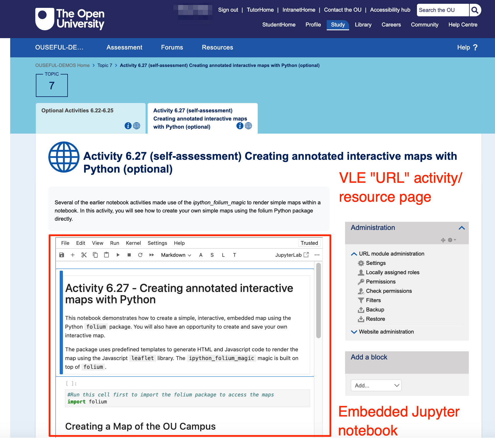

# Embedding a Single Notebook

Individual notebooks can be embedded within VLE URL activity/resource pages, or bundled into an `HTML5.zip` activity that can be rendered in an `HTML5` activity page, or embedded in a "website" page (e.g. as rendered from OU-XML).

Notebooks can be individually referenced via the `notebooks/index.html?path=NOTEBOOK.ipynb` path, allowing a particular notebook to be situated within the flow of a set of a week's activities, or embedded directly within a "website" web page:

In terms of learning design, embedding a notebook within a VLE page allows us to maitain a flow of activity from VLE based web content directly into an interactive activity. This allows students to:

- run code, either as presented, or modified or created by them, inline in the context of the surrounf materials;
- make notes in markdown cells inline in the materials.

Changes made to the notebook are saved into browser storage, which means that edits can persist across multiple study sessions if the student uses the same web browser across sessions.

*Currently, links from the notebook homepage/directory listing do not resolve correctly, so only single notebook access is supported in the notebook view at this time.*

*If a notebook distributed as part of the JupyterLite distribution is deleted from the Notebook or JupyerLab Table of Contents view, the notebook reverts to its originally distributed state. It would be useful if we could "delete" — that is, reset — a distributed notebook from the notebook `File` menu.*
