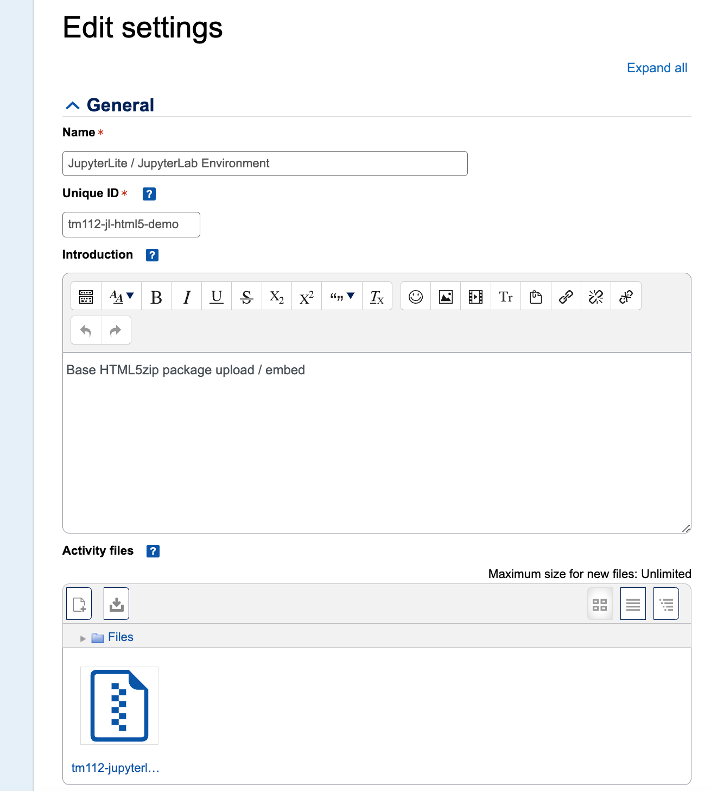
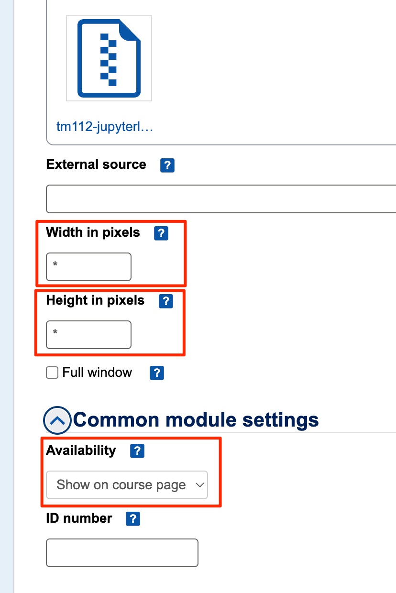
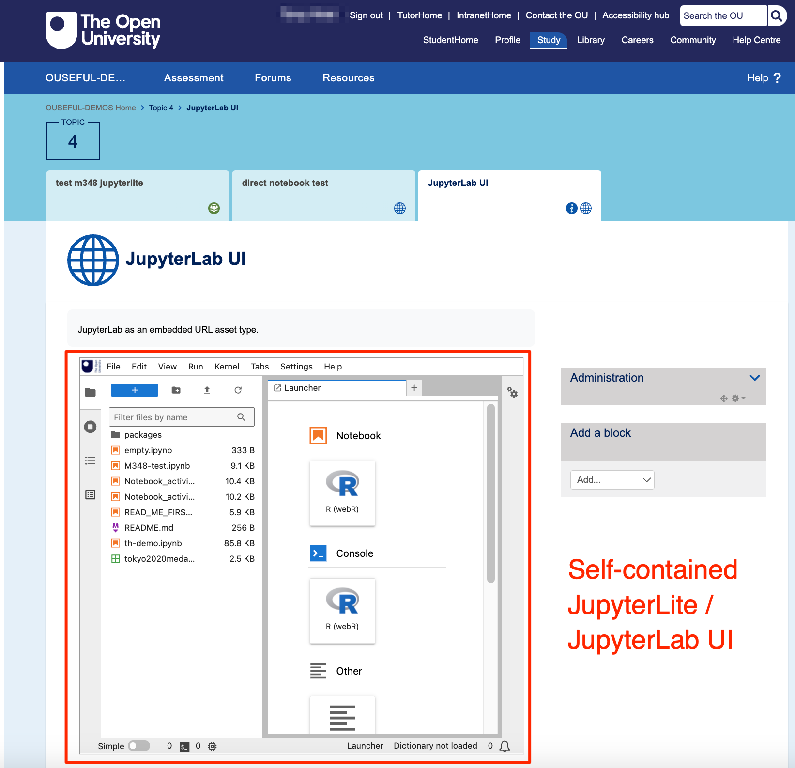

# Embedding JupyterLab and Jupyter Notebook in Moodle VLE Pages

A browser based JupyterLab enviroment can be embedded into a Moodle VLE page as an embedded URL, or bundled into an `HTML5.zip` activity that can either be rendered in an `HTML5` activity page, or embedded in a page rendered from OU-XML.

Give the page a sensible name and ID:

For the settings, set the `height` and `width` to `*`.

*It might make sense to also tick the `Full window` checkbox?

Where notebooks are bundled into the JupyterLite distribution, the JupyterLab or Jupyter notebook environment can be launched with a pre-opened notebook by setting `lab/index.html?path=NOTEBOOK.ipynb` in the URL path. If the [`jupyterlab-open-url-parameter`](https://github.com/jupyterlab-contrib/jupyterlab-open-url-parameter) extension is installed, notebooks can also be opened from a URL by setting one or more `&fromURL=NOTEBOOKURL` URL parameters.

